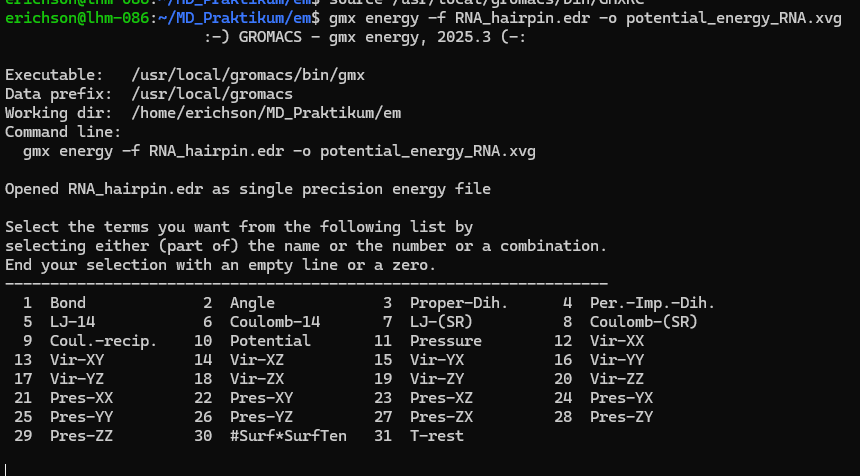

# 6 Auswertung

## 6.1 Äquilibrierung des Systems

**Dokumentieren Sie die einzelnen Äquilibrierungsschritte der Simulation (Energie-Minimierung, Temperatur- und
Druckanpassung) mithilfe geeigneter Grafiken.**

GROMACS bietet hierfür das Modul `energy`, mit dem verschiedene Werte aus den gespeicherten Energiedateien (`.edr`)
ausgelesen werden können.  
Mit dem folgenden Befehl lassen sich ausgewählte Parameter in eine `.xvg`-Datei exportieren:

```bash
gmx energy -f em/RNA_hairpin.edr -o em/potential_energy_RNA.xvg
```

Beim Ausführen des Befehls erscheint im Terminal eine Liste mit auswählbaren Parametern:



Geben Sie die entsprechende Nummer des gewünschten Parameters (z.B. **10 + Enter** für die potenzielle Energie) ein und
bestätigen
Sie anschließend mit **0 + Enter**, um die Auswahl zu beenden.

Die erzeugte .xvg-Datei kann anschließend mit Python eingelesen und weiterverarbeitet werden.
Sie können folgende Codezeilen dafür verwenden:

```python 
x, y = [], []
xlabel, ylabel = None, None

with open("em/potential_energy_RNA.xvg") as f:
    for line in f:
        if line.startswith("@"):
            if "xaxis" in line and "label" in line:
                xlabel = line.split('"')[1]
            elif "yaxis" in line and "label" in line:
                ylabel = line.split('"')[1]
        elif not line.startswith("#"):
            cols = line.split()
            x.append(float(cols[0]))
            y.append(float(cols[1]))

df = pd.DataFrame({xlabel: x, ylabel: y})

```

Als Ergebnis erhalten Sie ein Pandas DataFrame mit den Werten aus der `.xvg`-Datei, die Sie anschließend in Python
visualisieren können.

```{admonition} Aufgabe
Werten Sie alle Äquilibrierungsschritte mithilfe geeigneter Grafiken aus!
Erstellen Sie dabei separate Darstellungen für die Energie-Minimierung, die Temperatur- und die Druckäquilibrierung. Werten Sie auch die Aufgaben aus der Versuchdurchführung aus.
``` 

## 6.2 Strukturanalyse des MD-Laufs

**Charakterisieren Sie den Simulationslauf anhand der Strukturtrajektorie.**

Zur Erstellung und Bearbeitung von Trajektorien wird in GROMACS das Modul `trjconv` verwendet.
Für die Analyse sollen die Wassermoleküle und Ionen entfernt werden, und die periodischen Randbedingungen (PBC) müssen
gelöst werden, damit ein vollständiges RNA-Molekül dargestellt wird.

### Zentrieren und Korrigieren der Trajektorie

Konvertieren Sie zunächst die Trajektorie (`.xtc`) mit folgendem Befehl:

```bash
gmx trjconv -s md0/RNA_hairpin.tpr -f md0/RNA_hairpin.xtc -o md0/RNA_hairpin_centered.xtc -pbc mol -center
```

- s: Eingabedatei mit Topologie- und Simulationsinformationen (.tpr)
- f: Eingabedatei mit der ursprünglichen Trajektorie (.xtc)
- o: Name der Ausgabedatei für die zentrierte Trajektorie
- pbc mol: löst die periodischen Randbedingungen auf Molekülebene auf, sodass Moleküle nicht mehr über die Boxgrenzen
  hinaus abgeschnitten werden
- center: zentriert das gewählte Molekül (hier die RNA) in der Simulationsbox

Beim Ausführen des Befehls werden Sie zweimal aufgefordert, eine Molekülgruppe auszuwählen:

- Erste Auswahl: Wählen Sie die Gruppe 1 (RNA) für das Molekül, das exportiert werden soll.
- Zweite Auswahl: Wählen Sie erneut 1 (RNA) als Referenz, an der zentriert werden soll.

### Export der PDB-Trajektorie

Im nächsten Schritt wird eine reduzierte PDB-Trajektorie erzeugt, die nur ausgewählte Strukturen in bestimmten
Zeitabständen enthält:

```bash
gmx trjconv -s md0/RNA_hairpin.tpr -f md0/RNA_hairpin_centered.xtc -o md0/RNA_hairpin_trajectory.pdb -dt 10000
```

- dt 10000: exportiert nur jeden 10.000. Zeitschritt der Trajektorie, um die Dateigröße zu reduzieren

Mit diesem Befehl werden etwa 100 Strukturen in die PDB-Datei exportiert.

### Visualisieren der Trajektorie

Nutzen Sie das bereitgestellte PyMOL-Tutorial zur Visualisierung der erzeugten Trajektorie ([hier](#pymol_tutorial)).  

Für die quantitative Analyse verwenden Sie das Python-Paket MDAnalysis, mit dem sich strukturelle Parameter wie der Root Mean Square Deviation <a href="https://en.wikipedia.org/wiki/Root_mean_square_deviation" target="_blank">(RMSD)</a> berechnen lassen.  

Laden Sie die Trajektorie und die Referenzstruktur in Python wie folgt: 

```python
aligning_traj = mda.Universe("RNA_hairpin.pdb", "md0/RNA_hairpin_centered.xtc")
pdb_reference = mda.Universe("RNA_hairpin.pdb")
RMSD = rms.RMSD(aligning_traj, pdb_reference)
RMSD.run()
``` 
Erstellen Sie anschließend ein DataFrame mit den berechneten Werten:
```python
rmsd_df = pd.DataFrame(RMSD.results.rmsd, columns=["Frame","Time [ps]","RMSD"])
rmsd_df
```

Nutzen Sie gern das bereitgestellte Jupyter Notebook im Ordner `MD_Praktikum`, das diese Routinen bereits enthält.

```{admonition} Aufgabe
Analysieren Sie die Strukturbewegung der RNA mithilfe geeigneter Darstellungen:

1. Visualisieren Sie die Trajektorie in PyMOL und dokumentieren Sie Strukturänderungen.
2. Berechnen und plotten Sie den RMSD-Verlauf über die Zeit mit Python.
3. Interpretieren Sie den Verlauf der RMSD-Kurve.
```


