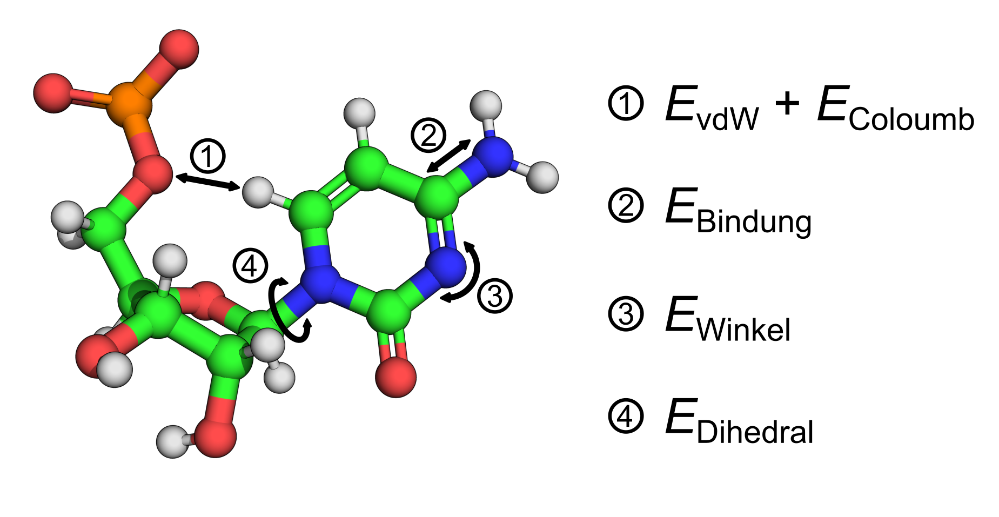

# 3 Grundlagen

Molekulardynamik (MD)-Simulationen werden verwendet, um die Bewegung bzw. Dynamik von Molekülen zu berechnen.  
In der Simulation wird die Bewegung in diskrete Zeitschritte unterteilt, sodass sich die Änderungen der Atompositionen
mithilfe der klassischen Mechanik berechnen lassen.

Für ein gegebenes Zeitintervall $\Delta t$ kann aus der Geschwindigkeit eines Atoms der Ort bestimmt werden:

$$
\Delta r = \Delta t \,v
$$

Bestimmt man die Kraft $F$, die auf ein Atom wirkt, so lässt sich auch die Geschwindigkeitsänderung des Atoms berechnen:

$$
\Delta v = \Delta t \,\frac{F}{m}
$$

wobei $m$ die Masse des Atoms ist.

Die Bestimmung der Kräfte basiert bei den sogenannten klassischen Verfahren auf empirischen Parametern, die entweder
quantenmechanisch oder experimentell bestimmt wurden. Abgeleitet werden die Kräfte aus der Summe aller potentiellen
Energien der möglichen Wechselwirkungen zwischen den Atomen:

$$
F_i = -\nabla E_{\text{Gesamt}}
$$

Zu den Wechselwirkungen zählen van-der-Waals-, Coulomb-, Bindungs-, Winkel- und Dihedralwechselwirkungen (
Abb. [1](#abb1)).

Tabellen mit diesen Parametern werden als Kraftfelder (force fields) bezeichnet. Für Biomoleküle existieren verschiedene
Varianten, die auf bestimmte Molekülklassen spezialisiert sind, z. B. AMBER, CHARMM oder OPLS.

Die Genauigkeit einer MD-Simulation hängt unter anderem vom gewählten Zeitschritt ab. In den Simulationen, die im
Praktikum betrachtet werden, liegt dieser im Femtosekundenbereich ($\Delta t = 1{-}2\,\mathrm{fs}$).  
Die Wahl des Zeitschritts ist entscheidend: Ist er zu groß, können Atome zu weit springen und Interaktionen verpassen,
was zu strukturellen „Clashes“ führt. Ist er zu klein, verlängert sich die Rechenzeit erheblich.  
Zur effizienten Integration der Bewegungsgleichungen wurden numerische Verfahren wie der Verlet-Algorithmus entwickelt,
der eine Lösung der Newtonschen Bewegungsgleichungen liefert, ohne explizit die Geschwindigkeiten zu berechnen (
basierend auf dem Leapfrog-Verfahren).

Neben dem Kraftfeld und den Grundlagen zur prinzipiellen MD-Rechnung müssen vor allem für biologische Systeme
Grundvoraussetzungen geschaffen werden, die es ermöglichen, experimentelle Umgebungsparameter zu reproduzieren.

Dies erfolgt in zwei Phasen:

- **Solvatisierungsphase**: Hier wird das Biomolekül in explizitem Wasser gelöst und Ionen dem System zugegeben.
- **Äquilibrierungsphase**: Hier wird die potentielle Gesamtenergie minimiert und danach Temperatur und Druck
  eingestellt.

### Solvatisierungsphase

In dieser Phase wird das *in silico* Molekül in eine definierte Simulationsbox gesetzt. Diese wird anschließend mit
expliziten Wassermolekülen gefüllt, und schließlich werden Ionen hinzugefügt, um das System zu neutralisieren und die
gewünschte Ionenkonzentration einzustellen.  
Nach diesen Schritten liegt das Molekül in Lösung vor, was es ermöglicht, die Wechselwirkungen mit dem Lösungsmittel zu
simulieren. Diese Interaktionen beeinflussen die Entwicklung des Systems und erlauben es zudem, Bewegungsparameter wie
die Diffusion eines Moleküls im Lösungsmittel abzubilden.  
Damit das Molekül in seiner Bewegung nicht durch die Grenzen der Box eingeschränkt wird und nicht an harte Wände stößt,
werden Simulationsboxen mit periodischen Randbedingungen verwendet.

### Äquilibrierungsphase

In dieser Phase wird das Gesamtsystem auf die Umgebungsbedingungen eingestellt, die auch unter experimentellen
Bedingungen vorliegen würden.  
Im ersten Schritt, der Energieminimierung, wird die Geometrie des Systems so lange angepasst, bis die potentielle
Gesamtenergie gemäß einer definierten Abbruchbedingung ein Minimum erreicht. Dadurch werden sterische „Clashes“ zwischen
Atomen beseitigt und eine stabile Ausgangsstruktur erzeugt.  
In GROMACS wird die Energieminimierung typischerweise mit dem <a href="https://manual.gromacs.org/documentation/2019/reference-manual/algorithms/energy-minimization.html" target="_blank">Steepest-Descent-Algorithmus</a> durchgeführt, da dieser
eine robuste Konvergenz bei stark verspannten Startstrukturen gewährleistet.

Anschließend erfolgt die Äquilibrierung von Temperatur und Druck.  
In einem **NVT-Ensemble** (konstante Teilchenzahl $N$, Volumen $V$ und Temperatur $T$) wird mithilfe eines Thermostaten
die Temperatur auf den Zielwert geregelt, indem die atomaren Geschwindigkeiten angepasst werden.  
In GROMACS kommt hierfür häufig das <a href="https://en.wikipedia.org/wiki/Berendsen_thermostat" target="_blank">Berendsen-Thermostat</a> zum Einsatz.  
Nach Erreichen des angestrebten Mittelwerts der Temperatur folgt die Druckäquilibrierung im **NpT-Ensemble** (konstante
Teilchenzahl $N$, Druck $p$ und Temperatur $T$). Dabei wird der Druck mithilfe eines Barostaten reguliert, der das
Volumen der Simulationsbox variiert.  
Ein Verfahren ist hier der <a href="https://pubs.aip.org/aip/jcp/article/153/11/114107/199610/Pressure-control-using-stochastic-cell-rescaling" target="_blank">Parrinello–Rahman-Barostat</a>, der realistische Druckfluktuationen und Volumenanpassungen im
Gleichgewicht ermöglicht.

Nach Abschluss der Äquilibrierung sind Temperatur, Druck und Dichte stabilisiert, und der Produktionslauf kann gestartet
werden. Dabei entwickelt sich das System über die Zeit entsprechend den newtonschen Bewegungsgleichungen, wodurch eine
Trajektorie des Zielmoleküls entsteht.
