# PyMOL Tutorial

Dieses kurze Tutorial zeigt, wie man **Nukleinsäurestrukturen** in PyMOL schnell und anschaulich visualisieren kann.  
Darüber hinaus werden grundlegende Funktionen von PyMOL demonstriert, die Sie auch für andere Moleküle anwenden können.

👉 Weiterführende Informationen finden Sie
im [PyMOL Wiki](https://pymolwiki.org/index.php/Practical_Pymol_for_Beginners).

---

## Installation von PyMOL

PyMOL kann über die offizielle Webseite (<a href="https://www.pymol.org/" target="_blank">hier</a>) heruntergeladen und
installiert werden.

Für Studierende an Hochschulen ist das Programm kostenlos.
Sie können sich mit Ihren Hochschuldaten registrieren und eine PyMOL-Lizenz anfordern unter:
<a href="https://www.pymol.org/edu/" target="_blank">https://www.pymol.org/edu/</a>

Für die Installation folgen Sie den Schritten des Installations-Assistenten.

---

## PyMOL Obergläche

Beim Start von PyMOL öffnet sich eine grafische Oberfläche, die aus vier Hauptbereichen besteht.
Im Zentrum befindet sich der Visualisierungsbereich, in dem alle geladenen Moleküle dargestellt werden. Hier kann man
das
Modell mit der Maus interaktiv bewegen: durch klicken und ziehen rotieren, mit gedrückter mittlerer Maustaste
verschieben und über das Mausrad hinein- und herauszoomen.

Am oberen Rand liegt die Menüleiste. Über diese Menüs lassen sich grundlegende Aktionen wie das Laden oder Speichern von
Dateien und Anzeigeoptionen steuern.

Auf der rechten Seite erscheint die Objektliste. Dort werden alle geladenen Strukturen, Moleküle oder Auswahlen
aufgeführt. Zu jedem Eintrag gibt es kleine Schaltflächen (z. B. A, S, H, L, C), mit denen sich
Darstellung, Sichtbarkeit, Farbe oder Transparenz gezielt ändern lassen.

Am unteren Rand befindet sich die Kommandozeile. Sie erlaubt den direkten Zugriff auf alle PyMOL-Kommandos. Darüber
liegt eine Statusanzeige, die kurze Hinweise oder Koordinateninformationen anzeigt.

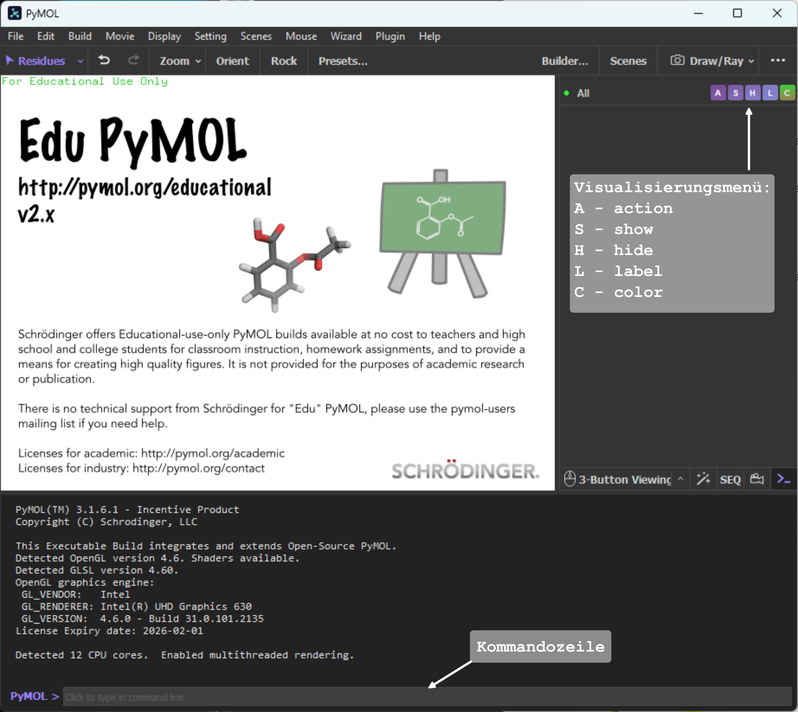]

---

## Visualisierung eines RNA-Hairpins

### Struktur einladen

Als Beispiel verwenden wir einen einfachen RNA‑Hairpin mit der **PDB‑ID 1HS1**.
Laden Sie die Struktur in PyMOL indem Sie folgenden Befehl in die Kommandozeile eingeben:

````bash
fetch 1hs1
````

Mit diesem Befehl wird die Struktur von der Protein Data Bank (PDB) heruntergeladen und in PyMOL geladen.

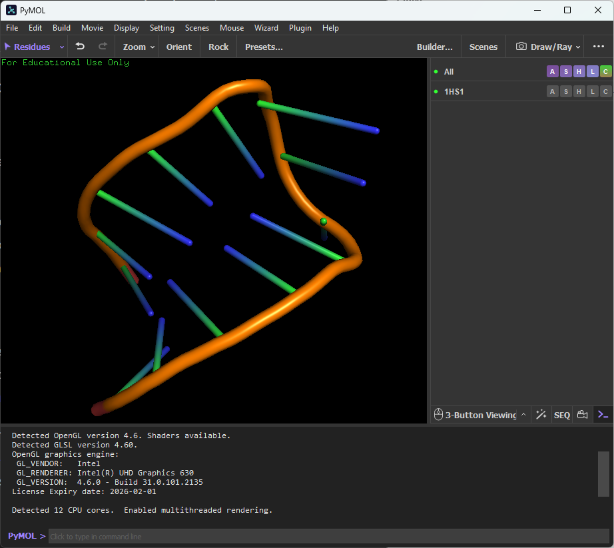

### Hintergrundfarbe ändern

Die Hintergrundfarbe des Visualsierungsfensters kann mit folgendem Befehl geändert werden:

```bash
bg_color white
```

### Cartoon-Darstellung anpassen

Nun können mit verschiedenen Befehlen die Darstellung des Hairpins angepasst werden. Im jetzigen Zustand ist der
RNA-Hairpin als **Cartoon** dargestellt. Hier sind die Basen als Sprossen der Basenleiter dargestellt und das
Phosphat-Zucker-Rückgrat als **Tube**.
Als Erstes verändern wir die Farbe des RNA-Rückgrats mit:

```bash
set cartoon_nucleic_acid_color, gray
```

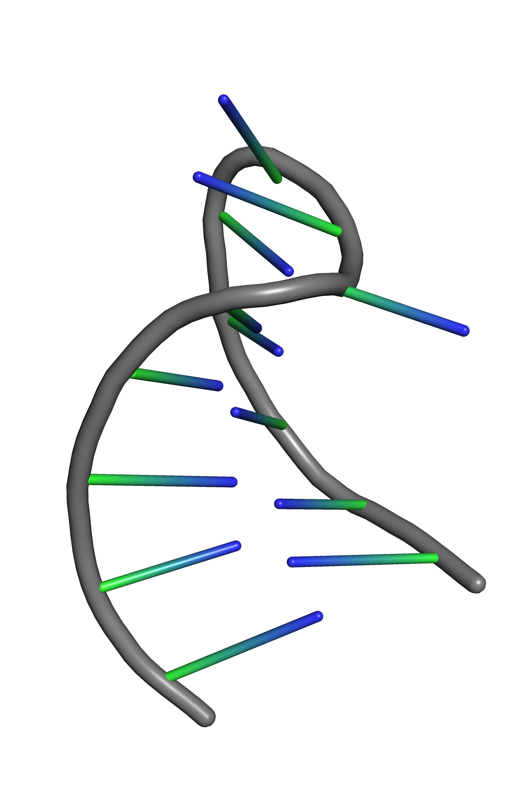

### Alternative Darstellungen

Neben der Cartoon-Darstellung gibt es auch andere Darstellungen wie **Sticks**, **Lines** und **Ribbon**. Je nach
Fragestellung können auch diese anderen Darstellungen verwendet werden. Um eine andere Darstellung zu verwenden, kann
das Visualisierungsmenü unter **S** (Show) genutzt werden. Man muss allerdings beachten, dass die aktuelle Darstellung
ausgeschaltet wird, falls gewünscht. Dies kann im Menü unter **H** (Hide) vorgenommen werden. Die folgenden Befehle
zeigen, wie man mit der Kommandozeile die Cartoon-Darstellung ausschaltet und stattdessen Sticks anzeigt:

```bash
show sticks
hide cartoon
```

Im folgenden Beispiel sind verschiedene Darstellungenoptionen aufgezeigt:

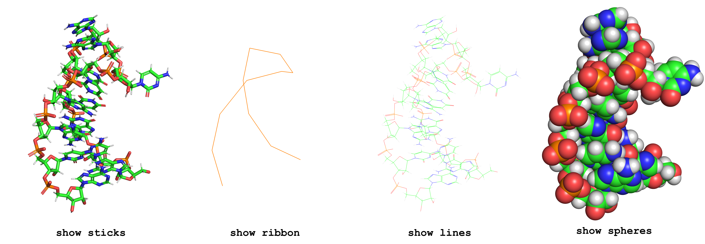

### Cartoon: Ringdarstellung anpassen

Bleiben wir vorerst in der Cartoon-Darstellung, so ergeben sich auch hier verschiedene Darstellungsoptionen, die zur
Visualisierung einer Nukleinsäurestruktur nützlich sind. Beispielsweise kann die Sprossendarstellung durch explizite
Darstellung von Basen und Ribose ersetzt werden. Der folgende Befehl zeigt, wie man den `cartoon_ring_mode` einstellen
kann:

```bash
set cartoon_ring_mode, 1
```

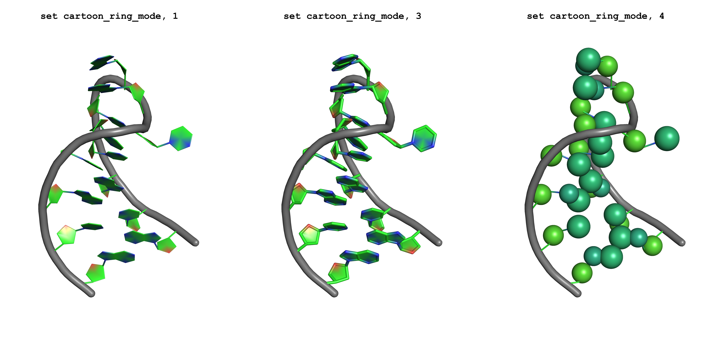

### Färben und Selektieren von Basen

Um die Farbe der Basen zu ändern, gibt es zwei Möglichkeiten: Entweder über das Menü **C** (Color), das die
vorinstallierten Farben anzeigt, oder über den Befehl `color` in der Kommandozeile. Als Beispiel färben wir die Basen
des Hairpins hellorange:

```bash
color brightorange
```

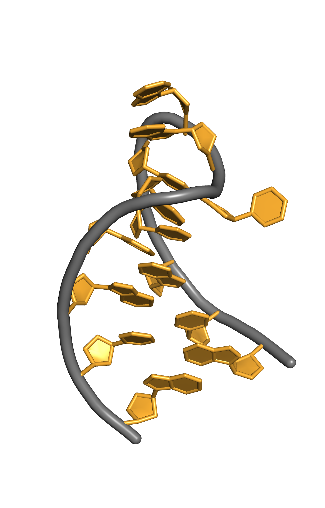

```{Note}
Das Rückgrat wird von dem Befehl `color` nicht betroffen, da vorher mit der Einstellung `cartoon_nucleic_acid_color` die Farbe gesetzt wurde. Wurde dieser Befehl vorher nicht ausgeführt, so wird auch die Farbe des Rückgrats angepasst.
```

---

Die bisherigen Einstellungen wurden immer global auf das gesamte Molekül angewendet. Um Highlights zu setzen oder
beispielsweise nur einzelne Basen einzufärben, müssen diese zunächst ausgewählt werden. Eine Möglichkeit ist, direkt auf
die gewünschte Base im Visualisierungsfenster zu klicken. Hierbei wird die gesamte Base (Residue) ausgewählt. Diese
Auswahl kann auch über die Sequenzansicht erfolgen. Um diese anzuzeigen, klicken Sie auf **Display → Sequence**.
Daraufhin erscheint oberhalb des Visualisierungsfensters die Sequenz des Moleküls. Nun können, wie im Bild gezeigt, die
erste und letzte Base des Hairpins angeklickt werden. Im Visualisierungsbereich wird die Auswahl durch pink-schwarze
Quadrate angezeigt. Im rechten Objektfenster erscheint ein Objekt mit der Bezeichnung `sele`.
Die Selektion kann auch über die Kommandozeile erfolgen. Ein Guide für die Selektion finden
Sie <a href="https://pymolwiki.org/index.php/Selection_Algebra" taget="_blank">hier</a>.

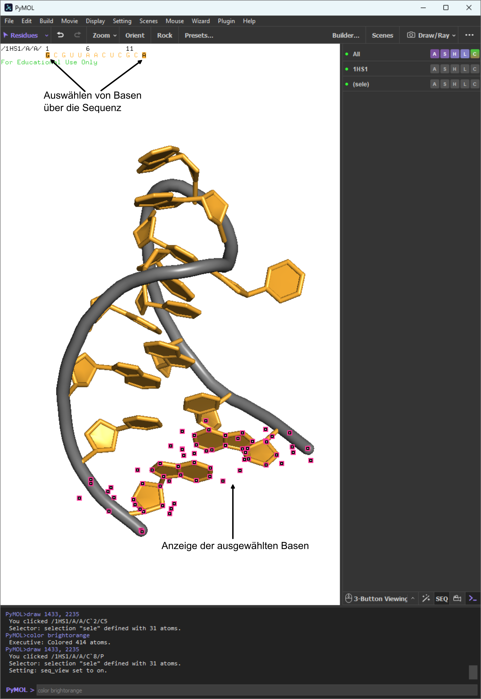

Mit dem Objekt, welches temporär durch die Selektion erzeugt wird, können nun die ausgewählten Basen eingefärbt werden.
Dafür wird der folgende Befehl verwendet:

```bash
color lightblue, sele
```

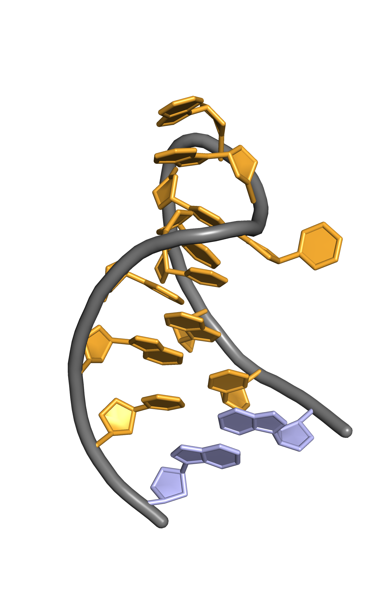

### Oberfläche darstellen

Die Oberflächendarstellung (Surface) in PyMOL ist ein zentrales Werkzeug, um die räumliche Form und Zugänglichkeit eines
Moleküls zu veranschaulichen. Während Stick- oder Cartoondarstellungen hauptsächlich den inneren Aufbau einer Struktur
verdeutlichen, zeigt die Surface-Darstellung die tatsächlich zugängliche Oberfläche, wie sie ein Lösungsmittel oder ein
Ligand wahrnehmen würde.

Im folgenden Beispiel wird die Oberfläche angezeigt und transparent dargestellt, sodass die darunter liegende
Cartoon-Darstellung sichtbar bleibt:

```bash
show surface
set transparency, 0.7
```

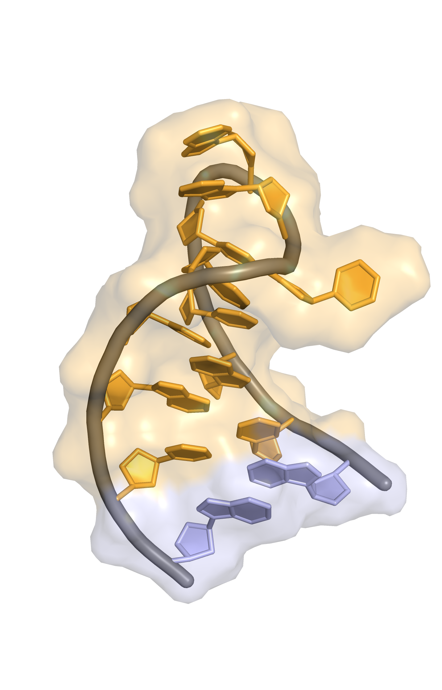

Die Oberfläche übernimmt nun dieselben Farben wie die Basen. Die Oberflächenfarbe kann auch unabhängig davon festgelegt
werden:

```bash
set surface_color, white
```

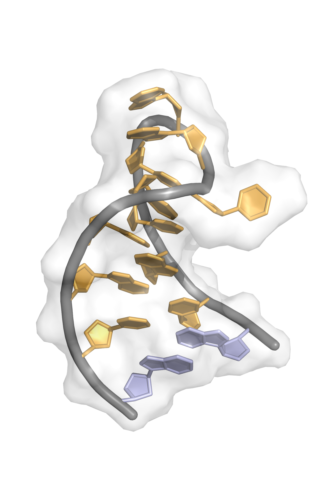

### Rendern einer PyMOL Visualisierung

Die Bisherigen Darstellungen sind einfache Screenshots der Strukturen gewesen. Das Rendern von Bildern in PyMOL ist ein
entscheidender Schritt, um aus der interaktiven Darstellung hochwertige und publikationsreife Abbildungen zu erzeugen.
Während die Standardansicht für die Arbeit im Programm ausreicht, bietet das Rendern eine deutlich verbesserte
Darstellung mit realistischen Beleuchtungseffekten, weichen Schatten und glatten Kanten. Dadurch werden molekulare
Strukturen klarer und visuell ansprechender wiedergegeben. Insbesondere für wissenschaftliche Veröffentlichungen,
Vorträge oder Poster ist das Rendern unverzichtbar.

Um in der PyMOL-GUI ein Bild mit Ray (slow) zu rendern, geht man folgendermaßen vor:
Rechts oben über der Objektauswahl wählt man "Draw/Ray" → "Units (300) DPI" → "Ray (slow)". PyMOL startet daraufhin den
Raytracing-Prozess und
berechnet die Szene mit hoher Qualität. Dieser Vorgang kann, abhängig von der Komplexität des Moleküls und der
Bildgröße, einige Sekunden bis Minuten dauern. Sobald das Rendering abgeschlossen ist, erscheint die verfeinerte
Ansicht direkt im Hauptfenster und kann anschließend über "Save Image to File" in verschiedenen Formaten
gespeichert werden.

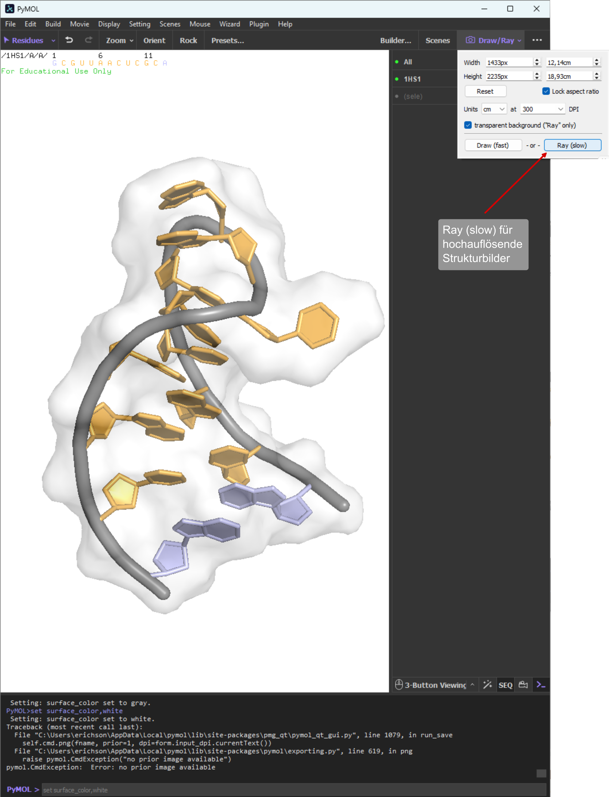

Auch hier gibt es verschiedene Modi, die das Aussehen des gerenderten Bilds beeinflussen. Der folgende Befehl erzeugt
beispielsweise eine schwarze Linie um die Cartoon-Elemente beim Rendern:

```bash
set ray_trace_mode, 1
```

Hier ist eine Übersicht der verschiedenen Ray-Tracing-Modi:


---

## Visualisierung einer MD-Trajektorie

TBA